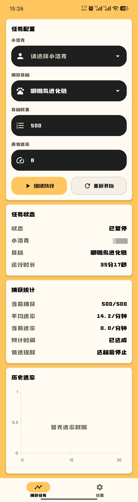
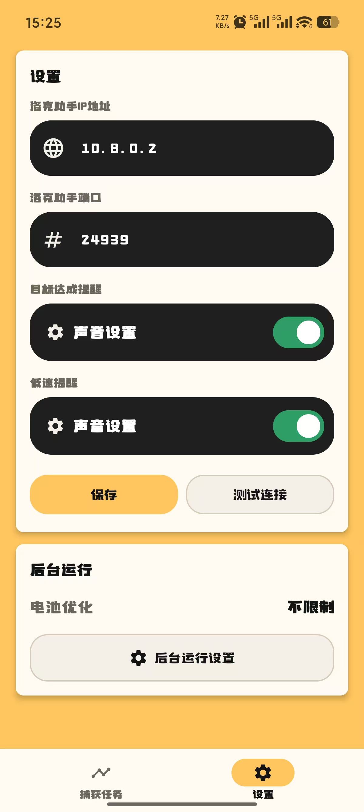

# 洛克捕手

洛克捕手是一款 Android 捕获监控工具，用于连接局域网内的洛克助手服务，监听指定账号的精灵捕获事件，并展示捕获数量、速率和任务进度。

本项目仅提供 Android 客户端。服务端由 [洛克助手（h3110w0r1d-y/rocom-helper）](https://github.com/h3110w0r1d-y/rocom-helper) 提供，使用前需要先部署并启动洛克助手，同时确保手机能够通过局域网访问其 IP 和端口。

## 功能

1. **捕获任务配置**
   - 读取洛克助手中的用户列表。
   - 支持按进化链、精灵名称或精灵 ID 搜索目标。
   - 可设置目标捕获数量和最低速率。
   - 支持暂停、继续当前任务和重新开始任务。

2. **实时捕获统计**
   - 通过 SSE 接收捕获事件，并使用 `gid` 去重。
   - 展示当前捕获数量、平均速率和最近 60 秒速率。
   - 展示最近 30 分钟的历史速率折线图。
   - 展示最近捕获时间、精灵名称和 `gid`。

3. **通知与后台监听**
   - 捕获数量达到目标时发送系统通知。
   - 当前速率持续低于设置值时发送低速提醒。
   - 使用前台服务维持后台监听，并在网络恢复或切换后自动重连。
   - 保存运行中的任务状态，在进程被系统回收后尝试恢复监听。

## 使用方法

1. 部署并启动 [洛克助手](https://github.com/h3110w0r1d-y/rocom-helper)。
2. 将运行洛克助手的服务器和 Android 手机接入同一局域网。
3. 在 App 设置页填写洛克助手的 IP 地址和端口，然后测试连接。
4. 读取并选择小洛克，搜索捕获目标，填写目标数量和最低速率。
5. 开始任务后可将 App 切到后台，监听状态会显示在常驻通知中。

## 通知声音配置

Android 8 及以上版本的通知声音、振动和重要级别由系统通知渠道管理。

- 在设置页点击“目标达成提醒”或“低速提醒”中的“声音设置”，可进入对应的系统通知渠道。
- 可分别配置通知声音、振动和是否允许弹出提醒。
- Android 13 及以上版本需要授予通知权限，否则提醒可能无法显示。
- 通知渠道创建后，App 无法直接覆盖用户在系统中选择的声音设置。

## 电池优化与后台运行

为了降低熄屏或切到后台后连接被系统冻结的概率：

1. 打开 App 的“设置”页。
2. 在“后台运行”区域点击“后台运行设置”。
3. 将洛克捕手的电池策略设置为“不限制”或允许忽略电池优化。
4. 部分手机还需要在系统管家中允许自启动、后台联网，并关闭自动清理。

App 使用 `connectedDevice` 前台服务和 WakeLock 提高后台监听稳定性，但 Android 及设备厂商仍可能在低电量、极端省电或手动强行停止时限制后台运行。手动“强行停止”后，App 无法自行恢复，需要重新打开。

## 应用截图

### 捕获任务

### 设置

## 开发环境

- Kotlin
- Jetpack Compose / Material 3
- OkHttp / Server-Sent Events
- DataStore Preferences
- Kotlinx Serialization
- Android SDK 36
- JDK 17

## 免责声明

- 本项目是独立开发的第三方客户端，与游戏开发商及运营方不存在隶属、授权或合作关系。
- 本项目只读取洛克助手提供的接口数据，不提供自动操作游戏、修改游戏数据或绕过安全机制的功能。
- 使用者应自行确认其使用行为符合所在地法律法规、游戏用户协议以及游戏的使用要求，并自行承担账号、设备、网络和数据方面的风险。
- 本项目按现状提供，不承诺监听消息绝不延迟、遗漏或重复，也不对因系统后台限制、网络中断、第三方接口变化或使用本项目造成的任何直接或间接损失承担责任。

