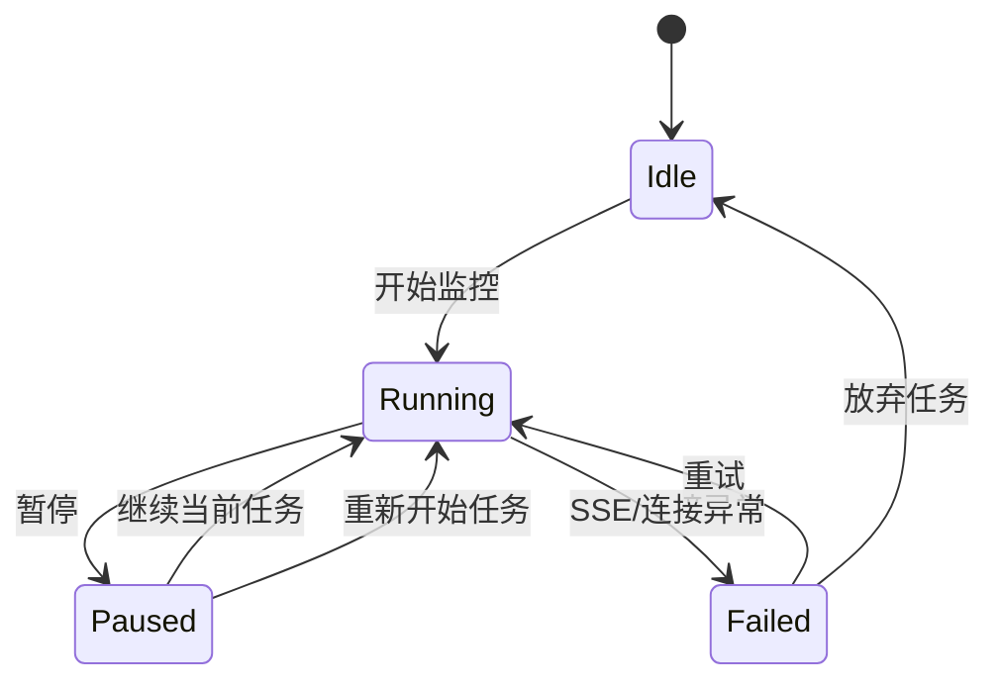
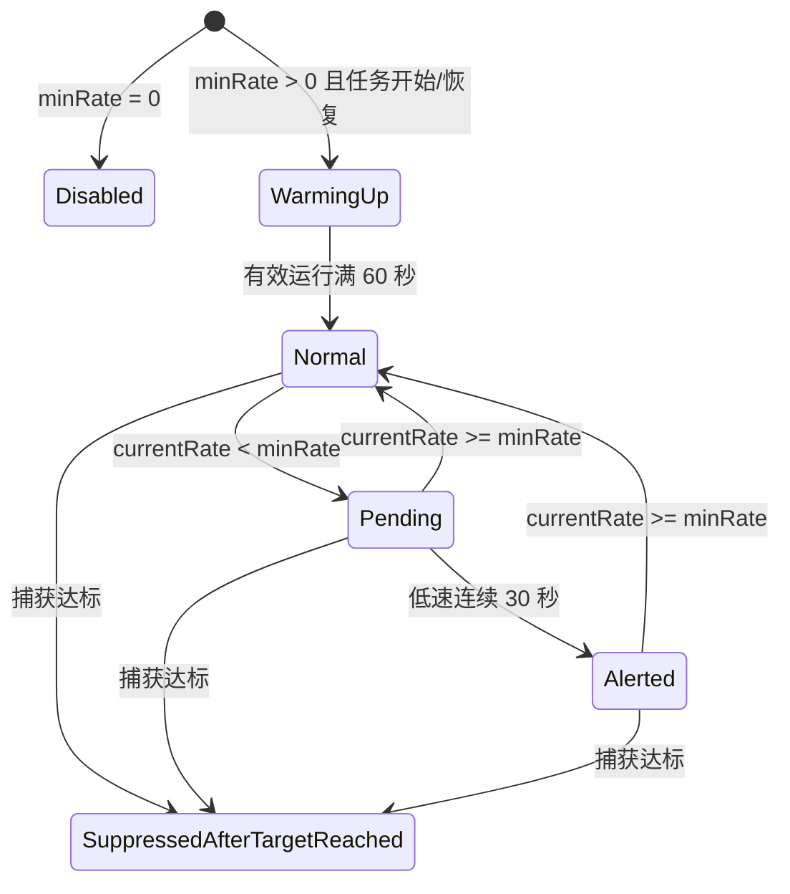

# 洛克助手捕获提醒 App 方案设计

版本日期：2026-07-09

## 1. 背景与目标

本项目实现一个独立 Android App，用于连接洛克助手本地接口，监听指定账号的精灵捕获事件。用户可以选择当前要抓的目标，目标可以是一条精灵进化链，也可以是单一精灵；设置目标捕获数量后，App 在捕获数量达标时发送一次系统通知，并在界面上持续展示捕获统计。

核心目标：

- 支持配置洛克助手服务的 IP 和端口，不提供默认值。
- 支持从洛克助手接口读取用户列表。
- 支持按进化链名称、精灵名称、精灵 ID 模糊搜索捕获目标。
- 支持选择“进化链”或“单一精灵”作为捕获目标。
- 通过 SSE 监听捕获事件，以 `base_conf_id` 判断目标，以 `gid` 做去重。
- 显示当前捕获数量、平均每分钟捕获速率、当前速率、历史速率折线图。
- 捕获数量达标后发送一次系统通知，之后继续监控和计数，直到用户手动暂停。
- 支持配置最低速率，当前速率过低时按规则提醒。
- 暂停后支持“重新开始任务”和“继续当前任务”两种恢复方式。

非目标：

- 不做自动抓宠或游戏操作控制。
- 不做多账号同时监控，MVP 只监控一个账号的一项任务。
- 不做云端同步，所有配置和任务状态保存在本机。

## 2. 已知资料

洛克助手接口地址由用户配置：

```text
http://{ip}:{port}
```

接口：

- `GET /api/users`
  - 返回用户列表。
  - 示例字段：`avatar`、`name`、`uid`。
- `GET /api/events?uid={uid}`
  - SSE 事件流。
  - 捕获相关事件：`event = pet_info.catch`（或 `type = pet_info.catch`）。
  - 精灵类型 ID：`data.data.base_conf_id`（兼容旧结构 `data.base_conf_id`）。
  - 单只精灵唯一 ID：`data.data.gid`（兼容旧结构 `data.gid`，也可用 `data.id`）。
  - 捕获时间：`data.catch_time` / `data.data.add_time`。
  - 扔球事件：`event = throw_ball`。
  - 球种 ID：`data.ball_id`。
  - 扔球时间：`data.time`。

本地数据：

- `evolution_chains.json`
  - 精灵进化链列表。
  - 每条进化链包含 `name` 和 `evolution_chain`。
  - `evolution_chain` 内每个精灵包含 `id` 和 `name`。

## 3. 推荐技术栈

Android：

- Kotlin
- Jetpack Compose
- Material 3
- ViewModel + Kotlin Flow
- DataStore Preferences 保存设置
- OkHttp 处理 HTTP 和 SSE
- Kotlinx Serialization 或 Moshi 解析 JSON
- 前台服务 `ForegroundService` 保持监听任务

图表：

- MVP 可用 Compose Canvas 自绘折线图。
- 如果后续要做缩放、提示点、坐标轴细节，可考虑引入 Vico。

## 4. 页面结构

### 4.1 主监控页

主监控页是 App 的第一工作界面，但当 IP 或端口未配置时，主页面应显示未配置状态，并引导用户进入设置页。

内容：

- 当前连接状态：未配置、未连接、连接中、监听中、已暂停、连接失败。
- 当前用户：从 `/api/users` 获取后选择。
- 当前目标：展示选中的进化链或单一精灵。
- 目标捕获数量。
- 最低速率配置，单位为“只/分钟”，`0` 表示关闭低速提醒。
- 操作按钮：
  - 开始监控
  - 暂停
  - 继续当前任务
  - 重新开始任务
- 统计区域：
  - 当前捕获数量：`caughtCount / targetCount`
  - 平均速率：有效运行时间内的平均每分钟捕获数
  - 当前速率：最近有效 60 秒窗口换算出的每分钟捕获数
  - 历史速率折线图
- 最近捕获列表：
  - 捕获时间
  - 精灵名称
  - `base_conf_id`
  - `gid`

### 4.2 目标选择页

目标选择页用于选择“进化链”或“单一精灵”。

交互：

- 顶部搜索框支持模糊搜索。
- 分段控件：
  - 进化链
  - 单一精灵
- 进化链结果：
  - 展示进化链名称。
  - 展示链内精灵名称和 ID。
  - 选中后匹配链内全部精灵 ID。
- 单一精灵结果：
  - 展示精灵名称、ID、所属进化链名称。
  - 选中后只匹配该精灵 ID。

搜索规则：

- 将搜索词和候选内容统一做 `trim`、小写化。
- 中文名称直接做 `contains`。
- 数字搜索匹配精灵 ID。
- 进化链模式下，搜索词命中链名或链内任一精灵名，都展示该进化链。
- 单一精灵模式下，搜索词命中精灵名、精灵 ID、所属链名，都展示该精灵。

### 4.3 设置页

设置项：

- 洛克助手 IP：必填，不提供默认值。
- 洛克助手端口：必填，不提供默认值。
- 测试连接按钮：
  - 请求 `GET /api/users`。
  - 成功时展示用户数量和用户列表摘要。
  - 失败时展示错误原因。
- 通知权限状态：
  - Android 13+ 需要请求 `POST_NOTIFICATIONS`。
  - 如果用户拒绝，界面应提示系统通知可能无法显示。
- 通知方式：
  - 目标达成通知：响铃、振动、响铃+振动。
  - 低速提醒通知：响铃、振动、响铃+振动。

## 5. 数据模型

```kotlin
data class AppSettings(
    val helperIp: String,
    val helperPort: Int?,
    val targetNotifyMode: NotifyMode,
    val lowSpeedNotifyMode: NotifyMode
)

enum class NotifyMode {
    Sound,
    Vibrate,
    SoundAndVibrate
}

data class HelperUser(
    val uid: String,
    val name: String,
    val avatar: Long?
)

data class EvolutionChain(
    val name: String,
    val pets: List<PetDefinition>
)

data class PetDefinition(
    val id: String,
    val name: String,
    val chainName: String
)

sealed class CaptureTarget {
    abstract val displayName: String
    abstract val targetBaseConfIds: Set<String>

    data class Chain(
        override val displayName: String,
        override val targetBaseConfIds: Set<String>
    ) : CaptureTarget()

    data class SinglePet(
        override val displayName: String,
        val petId: String,
        override val targetBaseConfIds: Set<String>
    ) : CaptureTarget()
}

data class CaptureTaskConfig(
    val user: HelperUser,
    val target: CaptureTarget,
    val targetCount: Int,
    val minRatePerMinute: Double
)
```

任务运行态建议放在 repository 或 service manager 中，用 `StateFlow` 暴露给 UI。

```kotlin
data class CaptureTaskState(
    val status: TaskStatus,
    val config: CaptureTaskConfig?,
    val caughtGids: Set<Long>,
    val caughtEvents: List<CaughtPetEvent>,
    val targetNotifySent: Boolean,
    val targetReachedAtMillis: Long?,
    val lowSpeedState: LowSpeedState,
    val activeRunStartedAtMillis: Long?,
    val accumulatedRunMillis: Long,
    val rateHistory: List<RatePoint>,
    val errorMessage: String?
)

enum class TaskStatus {
    Idle,
    Running,
    Paused,
    Failed
}

sealed class LowSpeedState {
    data object Disabled : LowSpeedState()
    data class WarmingUp(val startedAtMillis: Long) : LowSpeedState()
    data object Normal : LowSpeedState()
    data class Pending(val lowStartedAtMillis: Long) : LowSpeedState()
    data object Alerted : LowSpeedState()
    data object SuppressedAfterTargetReached : LowSpeedState()
}

data class CaughtPetEvent(
    val gid: Long,
    val baseConfId: String,
    val petName: String?,
    val caughtAtMillis: Long,   // 服务端 add_time
    val receivedAtMillis: Long, // 本地收到时间
    val effectiveRunMillis: Long
)

data class RatePoint(
    val bucketIndex: Long,
    val displayTimeMillis: Long,
    val count: Int,
    val ratePerMinute: Double
)
```

## 6. 任务状态机



状态说明：

- `Idle`：没有正在进行的捕获任务。
- `Running`：前台服务运行中，SSE 已连接或正在重连。
- `Paused`：用户手动暂停，SSE 断开，前台服务停止或降级。
- `Failed`：连接失败、解析异常或接口错误，保留任务上下文供用户重试。

暂停后的恢复：

- 继续当前任务：
  - 保留 `caughtGids`、捕获数量、历史曲线、目标达成状态。
  - 保留 `targetNotifySent`，因此达标通知不会重复触发。
  - 恢复后低速提醒重新进入 60 秒预热。
  - 暂停期间不计入有效运行时间。
- 重新开始任务：
  - 清空 `caughtGids`、捕获数量、历史曲线、目标达成状态。
  - 清空 `targetNotifySent`。
  - 恢复后低速提醒进入 60 秒预热。
  - 视为一个新的捕获提醒任务。

## 7. SSE 处理流程

SSE URL：

```text
http://{ip}:{port}/api/events?uid={uid}
```

处理流程：

1. 用户点击开始，校验设置、用户、目标、目标数量。
2. 启动前台服务。
3. 创建 SSE 连接。
4. 收到事件后解析 JSON。
5. 如果 `event/type != pet_info.catch`，忽略。
6. 读取精灵体中的 `base_conf_id`、`gid` 和捕获时间（`add_time`）。
7. 将捕获时间规范化为毫秒级服务端发生时间，同时记录本地收到时间。
8. 如果事件发生时间早于当前任务开始时间，作为历史补发忽略。
9. 如果 `base_conf_id` 不在当前目标 ID 集合，忽略。
10. 如果 `gid` 已存在于 `caughtGids`，忽略。
11. 将 `gid` 加入去重集合。
12. 记录捕获事件，更新计数、速率和历史曲线。
13. 如果计数达到目标并且 `targetNotifySent=false`，发送目标达成通知并标记已发送。
14. 如果计数已达到目标，低速提醒停止判断。
15. 如果计数未达到目标，继续执行低速提醒状态机。

去重策略：

- 去重范围为当前任务。
- 继续当前任务时保留去重集合。
- 重新开始任务时清空去重集合。
- 只以 `gid` 作为去重主键。

异常处理：

- SSE 断开时进入重连流程，但任务保持 `Running`。
- 重连时不清空去重集合。
- 连续重连失败时 UI 显示连接失败，但不自动清空任务。
- 用户可选择重试或暂停。

## 8. 统计与速率算法

平均速率使用有效运行时间计算；当前速率和历史曲线使用服务端事件发生时间，避免后台积压消息在恢复时被压缩到同一分钟。

有效运行时间：

```text
effectiveRunMillis = accumulatedRunMillis + (now - activeRunStartedAtMillis)
```

当任务暂停：

```text
accumulatedRunMillis += pausedAtMillis - activeRunStartedAtMillis
activeRunStartedAtMillis = null
```

当任务恢复：

```text
activeRunStartedAtMillis = now
低速提醒进入 60 秒预热
```

### 8.1 当前捕获数量

```text
caughtCount = caughtGids.size
```

### 8.2 平均每分钟速率

```text
averageRate = caughtCount / max(effectiveRunMillis / 60000.0, 1.0 / 60.0)
```

说明：

- 使用有效运行时间，不包含暂停时间。
- 运行时间很短时用最小分母保护，避免除零。

### 8.3 当前速率

当前速率按当前墙钟时间之前 60 秒的服务端事件发生时间计算。

推荐实现：

- 每次捕获事件记录服务端 `add_time` 和本地收到时间。
- 当前速率统计 `caughtAtMillis >= nowMillis - 60000` 的捕获数。
- 延迟到达的旧事件仍计入任务总捕获数，但不计入当前速率。
- 换算为每分钟：

```text
currentRate = countInLastWallClock60Seconds
```

因为窗口已经是 60 秒，捕获数就是“只/分钟”。如果有效运行时间不足 60 秒，可以仍按 60 秒窗口展示，低速提醒的 60 秒预热会避免早期误报。

### 8.4 历史速率折线图

按服务端事件发生时间分桶：

```text
bucketIndex = caughtAtMillis / 60000
```

每个桶记录该分钟内捕获数量：

```text
ratePerMinute = bucketCount
```

UI 展示：

- 横轴：最近 30 分钟，刻度为窗口内分钟数。
- 纵轴：每分钟捕获数。
- 延迟事件按真实发生分钟回填，不按本地收到时间集中绘制。
- 继续当前任务时曲线延续。
- 重新开始任务时曲线清空。

## 9. 目标达成通知

触发条件：

```text
caughtCount >= targetCount && targetNotifySent == false
```

触发行为：

- 发送系统通知一次。
- 按用户配置触发响铃、振动或响铃+振动。
- 设置 `targetNotifySent = true`。
- 设置 `targetReachedAtMillis = now`。
- 任务继续运行。
- 继续计数。
- 不再触发低速提醒。
- 用户手动暂停才停止监听。

通知文案建议：

```text
标题：捕获目标已达成
内容：{目标名称} 已捕获 {caughtCount}/{targetCount}
```

前台服务常驻通知仍继续展示当前状态，例如：

```text
正在监听：{目标名称}
已捕获 {caughtCount}/{targetCount}，当前速率 {currentRate}/分钟
```

## 10. 低速提醒规则

配置项：

```text
minRatePerMinute
```

规则：

- `minRatePerMinute = 0` 表示关闭低速提醒。
- 任务开始后进入 60 秒预热期。
- 从暂停恢复后也重新进入 60 秒预热期。
- 预热期间不判断低速。
- 如果捕获数量已经达标，不再触发低速提醒。
- 预热结束后，如果 `currentRate < minRatePerMinute` 连续持续 30 秒，发送一次低速提醒。
- 不需要提醒冷却期。
- 同一次低速区间只提醒一次。
- 当 `currentRate >= minRatePerMinute`，解除低速状态。
- 恢复正常后如果再次跌破阈值，可重新进入 30 秒持续判断并再次提醒。

低速状态机：



低速提醒文案建议：

```text
标题：捕获速率偏低
内容：{目标名称} 当前速率 {currentRate}/分钟，低于 {minRatePerMinute}/分钟
```

## 11. 前台服务与通知

需要前台服务的原因：

- SSE 需要在 App 切后台或息屏时继续运行。
- 监听行为是用户可感知的持续任务，适合用前台服务。

建议通知渠道：

- `monitor_status`
  - 前台服务常驻通知。
  - 低打扰，展示当前监听状态。
- `target_reached`
  - 目标达成通知。
  - 支持响铃和振动。
- `low_speed`
  - 低速提醒通知。
  - 支持响铃和振动。

Android 注意事项：

- Android 13/API 33+ 发送普通通知需要 `POST_NOTIFICATIONS` 运行时权限。
- 前台服务启动时必须有前台服务通知。
- Android 14/API 34+ 前台服务需要声明合适类型。洛克助手运行在局域网服务器上，本项目使用 `connectedDevice`，避免 Android 15+ 对 `dataSync` 的 6 小时后台时限。
- 任务运行期间持有 `PARTIAL_WAKE_LOCK`，暂停或服务销毁时释放；系统仍可能在低功耗待机时限制网络，因此需要同时引导用户关闭电池优化。
- Android 8/API 26+ 必须使用通知渠道；渠道创建后，声音、振动、重要级别等行为不能由 App 随意修改，用户可在系统设置中调整。
- 洛克助手接口是 HTTP，Android 9/API 28+ 默认不允许明文流量，需要配置 network security config。由于 IP 由用户输入，MVP 可使用 `base-config cleartextTrafficPermitted="true"`，后续如果固定域名或网段，可收窄范围。

## 12. 权限与 Manifest

建议权限：

```xml
<uses-permission android:name="android.permission.INTERNET" />
<uses-permission android:name="android.permission.VIBRATE" />
<uses-permission android:name="android.permission.POST_NOTIFICATIONS" />
<uses-permission android:name="android.permission.FOREGROUND_SERVICE" />
<uses-permission android:name="android.permission.FOREGROUND_SERVICE_CONNECTED_DEVICE" />
<uses-permission android:name="android.permission.ACCESS_NETWORK_STATE" />
<uses-permission android:name="android.permission.CHANGE_NETWORK_STATE" />
<uses-permission android:name="android.permission.WAKE_LOCK" />
<uses-permission android:name="android.permission.REQUEST_IGNORE_BATTERY_OPTIMIZATIONS" />
```

前台服务声明示意：

```xml
<service
    android:name=".monitor.CaptureMonitorService"
    android:exported="false"
    android:foregroundServiceType="connectedDevice" />
```

明文流量配置示意：

```xml
<application
    android:networkSecurityConfig="@xml/network_security_config">
    ...
</application>
```

```xml
<?xml version="1.0" encoding="utf-8"?>
<network-security-config>
    <base-config cleartextTrafficPermitted="true" />
</network-security-config>
```

## 13. 模块划分

建议包结构：

```text
app/
  data/
    local/
      SettingsStore.kt
      EvolutionChainLoader.kt
    remote/
      HelperApi.kt
      HelperSseClient.kt
    model/
      EvolutionChain.kt
      CaptureTask.kt
      HelperUser.kt
  monitor/
    CaptureMonitorService.kt
    CaptureTaskManager.kt
    RateCalculator.kt
    LowSpeedAlertStateMachine.kt
    CaptureEventParser.kt
  notification/
    NotificationChannels.kt
    CaptureNotifier.kt
  ui/
    main/
      MonitorScreen.kt
      MonitorViewModel.kt
    target/
      TargetPickerScreen.kt
      TargetPickerViewModel.kt
    settings/
      SettingsScreen.kt
      SettingsViewModel.kt
```

职责：

- `HelperApi`：获取用户列表、测试连接。
- `HelperSseClient`：封装 SSE 连接、断开、重连和事件回调。
- `EvolutionChainLoader`：从 assets 加载 `evolution_chains.json`。
- `CaptureTaskManager`：维护任务状态、去重集合、计数、目标达成、暂停恢复。
- `RateCalculator`：计算有效运行时间、平均速率、当前速率、历史桶。
- `LowSpeedAlertStateMachine`：独立处理低速提醒规则，便于单元测试。
- `CaptureNotifier`：发送目标达成和低速提醒通知。
- `CaptureMonitorService`：持有 SSE 监听生命周期，更新前台服务通知。

## 14. 关键实现细节

### 14.1 事件解析

只需要从完整事件中提取最小字段：

```kotlin
data class SseEnvelope(
    val event: String, // pet_info.catch
    val data: PetCatchEnvelope?
)

data class PetCatchEnvelope(
    val catch_time: Long?,
    val id: Long?,
    val data: PetCatchData?
)

data class PetCatchData(
    val base_conf_id: Long?,
    val gid: Long?,
    val add_time: Long?
)
```

实际 JSON 中字段很多，不建议建立完整模型，避免后续接口新增字段造成维护负担。

### 14.2 ID 类型

- `evolution_chains.json` 内 `id` 是字符串。
- SSE 中 `base_conf_id` 是数字。
- 匹配时统一转成字符串或 Long。
- 推荐内部统一为 `String`，因为本地 JSON 已是字符串，展示也方便。

### 14.3 任务状态持久化

DataStore 持久化：

- IP
- 端口
- 通知方式
- 最近选择的用户
- 最近选择的目标
- 最近目标数量
- 最近最低速率
- `caughtGids`
- 最近捕获事件和运行时间
- 当前任务配置和开始时间
- 低速提醒状态
- 目标达成状态

运行中的任务在事件、连接状态和低速状态变化时保存。进程被系统回收后，`START_STICKY` 服务读取快照、重建历史速率并恢复 SSE；暂停或失败任务只恢复到 UI，不自动启动监听。

### 14.4 重连策略

建议：

- 首次断开后 1 秒重连。
- 之后指数退避：2 秒、4 秒、8 秒、最多 30 秒。
- 用户手动暂停时不重连。
- 重连期间前台服务通知显示“正在重连”。
- 重连成功后继续当前任务，不重置低速预热。只有用户手动暂停后恢复，才重新进入 60 秒预热。
- 使用 `ConnectivityManager.registerDefaultNetworkCallback` 监听默认网络；网络丢失时立即取消当前 SSE，网络恢复或切换时重建连接。
- 每个 SSE 连接分配递增代次，已取消连接的迟到回调直接忽略。

### 14.5 低速提醒与重连

网络断开时没有捕获事件，当前速率可能下降。建议策略：

- SSE 断线重连期间暂停低速判断。
- SSE 断线重连期间不计入有效运行时间。
- 重连成功后不重置任务计数、不重置历史曲线、不重置低速预热。
- 如果断线前已经处于低速 `Pending` 状态，重连期间暂停 30 秒持续计时，重连后继续判断。
- 如果断线前已经处于低速 `Alerted` 状态，重连后仍保持已提醒状态，直到当前速率恢复到阈值以上。
- 这样可以避免网络波动导致误报，同时保持“暂停后恢复才重新预热”的规则清晰。

## 15. MVP 验收标准

功能验收：

- 未配置 IP/端口时无法开始监控，并引导到设置页。
- 设置页可保存 IP/端口，并能测试 `/api/users`。
- 用户列表可展示并选择。
- 目标选择支持进化链和单一精灵。
- 搜索可命中进化链名称、精灵名称、精灵 ID。
- 开始后能连接 SSE。
- 非 `pet_info.catch` 事件会被忽略。
- 非目标 `base_conf_id` 会被忽略。
- 重复 `gid` 不重复计数。
- 捕获数量、平均速率、当前速率、历史折线图会更新。
- 达标后系统通知只触发一次。
- 达标后继续监控和计数。
- 达标后不再触发低速提醒。
- 最低速率为 0 时不触发低速提醒。
- 最低速率大于 0 时，开始后 60 秒内不触发低速提醒。
- 当前速率低于最低速率连续 30 秒后触发一次低速提醒。
- 当前速率恢复到阈值以上后，下一次跌破可再次提醒。
- 暂停后停止 SSE。
- 继续当前任务保留计数和历史。
- 重新开始任务清空计数和历史。
- 两种恢复方式都会让低速提醒重新进入 60 秒预热。

技术验收：

- Android 13+ 通知权限有请求入口。
- Android 8+ 通知渠道创建正常。
- HTTP 明文请求可连接用户配置的洛克助手地址。
- 前台服务通知在监听期间持续存在。

## 16. 测试建议

单元测试：

- 目标匹配：进化链、单一精灵、ID 类型转换。
- 模糊搜索：链名、精灵名、ID、空搜索。
- `gid` 去重。
- 平均速率计算。
- 当前速率计算。
- 历史分桶。
- 低速提醒状态机。
- 目标达成通知只触发一次。
- 暂停恢复有效运行时间计算。

集成测试：

- Mock `/api/users` 返回用户列表。
- Mock SSE 推送捕获事件。
- Mock SSE 重复推送同一 `gid`。
- Mock SSE 断开和重连。
- 验证暂停后不再接收事件。

手工测试：

- Android 13+ 拒绝通知权限时，界面提示是否正确。
- Android 8+ 通知渠道是否出现。
- 熄屏或切后台后监听是否继续。
- IP 或端口错误时错误提示是否清楚。
- 洛克助手服务不可用时是否可重试。

## 17. 参考资料

本地资料：

- `资料.md`
- `evolution_chains.json`

Android 官方资料：

- [Notification runtime permission](https://developer.android.com/develop/ui/views/notifications/notification-permission)
- [Foreground services overview](https://developer.android.com/develop/background-work/services/fgs)
- [Foreground service types](https://developer.android.com/develop/background-work/services/fgs/service-types)
- [Network security configuration](https://developer.android.com/privacy-and-security/security-config)
- [Create and manage notification channels](https://developer.android.com/develop/ui/views/notifications/channels)
